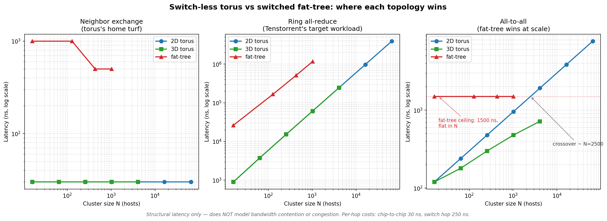

# tenstorrent-topology-lab

A small, laptop-runnable simulator that tests the structural latency claim at
the heart of Tenstorrent's switch-less networking pitch:

> **Hypothesis:** removing the network switch and using a 2D torus minimizes
> latency for *neighbor* and *structured collective* traffic (ring all-reduce
> in particular). For *irregular all-to-all* traffic at scale, a switched
> fat-tree is competitive or better, because torus network diameter grows
> with sqrt(N) while a fat-tree's diameter is fixed regardless of cluster
> size.

This repo accompanies analysis (LinkedIn + Substack, 2026) of Tenstorrent
Blackhole's switch-less networking architecture. The argument the simulator
supports is narrow: switch-less 2D torus is sound engineering for ring
all-reduce and neighbor traffic; compiler claims that abstract a
heterogeneous latency hierarchy from model code are the part that needs
longer empirical validation. The simulator exists so the
latency-versus-topology piece of that argument is checkable, not just stated.

> **Context for future readers:** written in 2026 against Tenstorrent
> Blackhole P150 (4× QSFP-DD, shipping 2025–2026) and NVIDIA H100 NVLink as
> the comparison point. Per-hop latency assumptions (chip 30 ns, switch
> 250 ns) are realistic for 2026 cutting-edge hardware; both numbers move
> over time. The chart's *shape* depends on graph-theoretic facts (torus
> diameter grows as sqrt(N), fat-tree diameter is constant) that don't
> change. The crossover N is computable in closed form:
> `N ≈ (SWITCH_HOP_NS × 6 / CHIP_HOP_NS)²`. Adjust the constants in
> `latency_model.py` for newer hardware and re-run.

## What you get



Three subplots, log-log axes:

- **Neighbor exchange** (torus's home turf): 2D and 3D torus are flat at 30 ns
  because every neighbor is one chip-hop away. Fat-tree is 17-33x slower
  because every neighbor lookup traverses at least 2 switch hops.
- **Ring all-reduce** (Tenstorrent's target workload): 2D and 3D torus are
  4-8x faster per ring step than fat-tree. Both grow linearly with N. This is
  the headline win for Tenstorrent's chosen topology.
- **All-to-all** (where switched fabric wins at scale): 2D torus diameter
  grows as sqrt(N); fat-tree diameter is fixed at 6 hops = 1500 ns. The
  structural-latency crossover where fat-tree beats 2D torus on all-to-all
  appears around N≈2500 in this model. **3D torus stays below the fat-tree
  ceiling all the way out to N=4096** — which is exactly why Google TPU
  (3D torus, Ironwood superpods of 9216 chips) and AWS Trainium2 (4×4×4 3D
  torus) both chose 3D rather than 2D.

## How to run

```bash
pip install -r requirements.txt
python3 run.py
```

You'll see a markdown table of latencies on stdout and the chart will be
written to `output/latency_vs_N.png`. The whole thing finishes in about 5
seconds on a modern laptop.

> **Want to verify the model yourself?** [TUTORIAL.md](TUTORIAL.md) is a
> step-by-step walkthrough that sets up the simulator and validates each of
> its outputs against graph-theoretic facts you can compute by hand. Useful
> if you plan to cite the chart in your own analysis.

## How it works

It's less of a simulator than the word suggests — it's a closed-form latency
calculator built on textbook graph properties.

1. **Topologies** (`topologies.py`): NetworkX builds 2D torus, 3D torus, and
   k-ary fat-tree (Al-Fares et al., SIGCOMM 2008) graphs. Edges carry a
   `kind` attribute in `{"chip", "switch"}`.
2. **Per-hop latencies** (`latency_model.py`):
   - chip-to-chip: 30 ns (Tenstorrent-style direct neighbor)
   - switch hop: 250 ns (Broadcom Tomahawk Ultra cutting-edge cut-through)
3. **Workloads** (`workloads.py`): three closed-form metric functions per
   topology.
   - Neighbor exchange: max latency over each host's 4 closest peers.
   - Ring all-reduce: sum of adjacent-pair latencies × 2(N-1)/N (standard
     Reduce-Scatter + All-Gather).
   - All-to-all: max pairwise host-host latency = network diameter × per-hop.
4. **Sweep + plot** (`run.py`): cluster size N over `[16, 64, 128, 256, 432,
   1024, 4096, 16384, 65536]`, three workloads × three topologies.

The original implementation used all-pairs Dijkstra. That didn't scale past
~1024 hosts on the fat-tree (~10 minutes per run on a laptop). The current
code uses analytical formulas for distances on the regular topologies,
keeping the runtime laptop-friendly even at N=65,536.

## What this model does NOT capture

This is the part that matters if you're going to argue with the chart:

1. **No bandwidth contention.** When 1000 hosts simultaneously send to 1000
   other hosts on a torus, multiple paths share chip-to-chip links and each
   link's bandwidth gets divided. The model treats each pair's latency as if
   it had the link to itself.
2. **No congestion or queueing.** Real switches buffer; under load, latency
   goes up and tails get long. None of that here.
3. **No serialization for full packet sizes.** Per-hop = 30 ns is the cost
   of one tiny header-sized message. A 1 MB tensor takes longer because of
   bytes ÷ link-rate, not just hop count.
4. **No software stack overhead.** Driver, RDMA library, NCCL, framework —
   none of that. Add tens of microseconds for that in real systems.
5. **No optical-switch reconfiguration.** Google TPU's OCS lets the fabric
   reshape mid-job; not modeled.
6. **No protocol-stack difference.** Tenstorrent's stripped protocol vs RoCE
   vs TCP/IP is exactly the kind of thing this model doesn't see.

The argument the chart makes is **topology-level**: at this layer of
abstraction, the model demonstrates the trade-off. A reader who pushes back
on the absolute numbers is right; a reader who pushes back on the *shape* of
the curves needs to disagree with graph-theoretic facts about diameter.

## What it's actually good for

Two things, narrowly:

1. **It demonstrates the graph-theoretic structural fact** that 2D torus
   diameter grows as sqrt(N) and fat-tree diameter doesn't. Anyone disputing
   the chart has to dispute textbook properties of those topologies.
2. **It makes the per-hop tradeoff concrete.** "Switch hop costs 8x a chip
   hop" turns into a visualizable curve with an actual crossover number. The
   crossover at N≈2500 falls out of the 30 ns vs 250 ns ratio applied to
   torus diameter geometry — change those numbers and the crossover moves
   predictably.

If you read the chart as "Tenstorrent will beat fat-tree below N=2500 in
real workloads," you're reading more into the model than is there.

## Citations for the per-hop numbers

- **Switch hop ~250 ns:** Broadcom Tomahawk Ultra spec (Network World,
  "Broadcom scales up Ethernet with Tomahawk Ultra for low latency HPC and
  AI", 2025). This is the cutting-edge cut-through number; more typical
  cut-through Ethernet switches run 500 ns – 2 µs.
- **Chip-to-chip hop ~30 ns:** order-of-magnitude figure for high-speed
  SerDes plus a short DAC cable. Tenstorrent's on-die NoC is faster than
  this; the QSFP-DD chip-to-chip link is roughly in this range.
- **Topology-diameter facts:** Wikipedia "Torus interconnect"; Al-Fares,
  Loukissas, Vahdat. "A Scalable, Commodity Data Center Network
  Architecture." SIGCOMM 2008.

## License

MIT — see [LICENSE](LICENSE).

## Citing

If this analysis is useful in your own work, a link back to the companion
LinkedIn / Substack post is appreciated. (Post URL added once published.)
